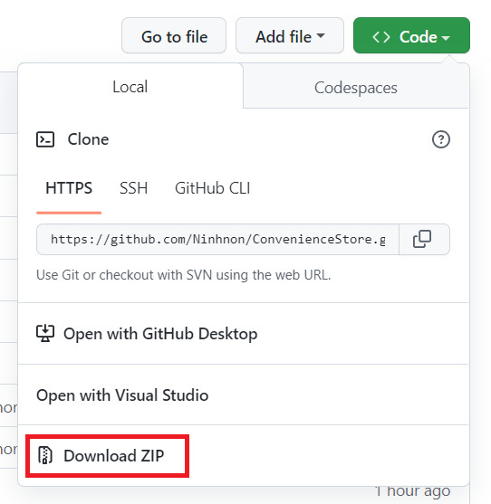
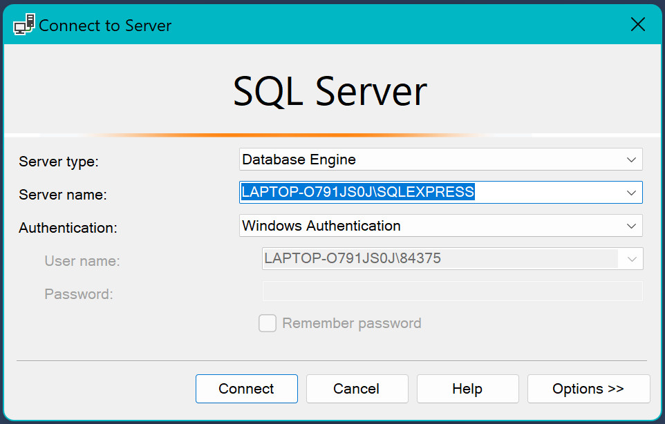
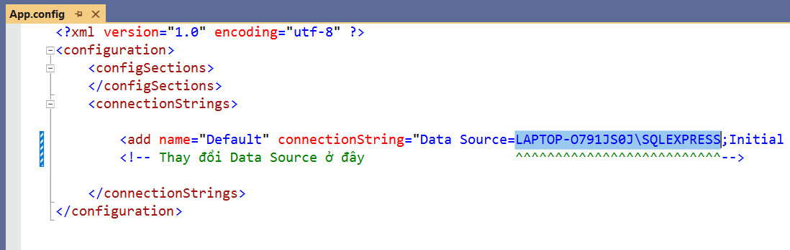

༼ つ ｡◕‿‿◕｡ ༽つ

## ConvenienceStore

<a href="https://dotnet.microsoft.com/en-us/download/dotnet/6.0">
    
</a>
<a href="https://m2.material.io/design">
    
</a>

ConvenienceStore là ứng dụng quản lí chuỗi cửa hàng tiện lợi với đầy đủ các tính năng thực tế và thiết thực.

<p align="center">
    
    
    
 <br />
    
    
</p>

## Nổi bật 🐳

- QR Scan, Barcode Scan 🤖
- [MVVM pattern](https://en.wikipedia.org/wiki/Model%E2%80%93view%E2%80%93viewmodel)
- [FluentValidation](https://docs.fluentvalidation.net/en/latest/)
- [LiveChartWpf](https://github.com/beto-rodriguez/LiveCharts2)
- [AForge Video](http://www.aforgenet.com/)
- [Emgu.CV](https://www.emgu.com/wiki/index.php/Main_Page)

## Tính năng 🦉

Chi tiết xem [tại đây](./BAOCAO.pdf)

## Hướng dẫn sử dụng ⚙️

### `1. Cài đặt phầm mềm`

- Cài đặt [Visual Studio 2022](https://visualstudio.microsoft.com/downloads/).
- Cài đặt [SQL Sever 2022](https://www.microsoft.com/en-us/sql-server/sql-server-downloads) và SSMS. Xem hướng dẫn [tại đây](https://www.youtube.com/watch?v=O2yhVbvfwWs&t=276s).
- Cài đặt phần mềm để kết nối camera điện thoại với Laptop/PC  
  Nhóm em đề xuất [Camo](https://reincubate.com/camo/). Xem hướng dẫn cài đặt và sử dụng [tại đây](https://www.youtube.com/watch?v=6EQX4yDh72M&ab_channel=WasayTechTips).

### `2. Tải dự án về máy`

- **Cách 1**: Clone về với git

  ```sh
  git clone https://github.com/Ninhnon/ConvenienceStore.git
  ```

- **Cách 2**: Tải tập tin ZIP  
  

### `3. Khởi tạo quan hệ`

- Trong thư mục ConvenienceStore vừa tải, tìm file **script.sql** và mở trong Microsoft SQL Server Management Studio.

- Một cửa sổ nhỏ xuất hiện như hình bên dưới. Chú ý lưu **Server name** lại.  
  VD ở đây: LAPTOP-O791JS0J\SQLEXPRESS  
    
   Chọn "Conect"

- Nhấn chuột vào nội dung file. Chọn **Execute** hoặc nhấn **F5**.

- Quay lại thư mục ConvenienceStore. Mở file **ConvenientStore.sln**

- Solution Explorer nằm phía bên trái. Nếu không thấy, vào **View** -> chọn **Solution Explorer**

- Nhấp đúp chuột vào **App.config**

- Thay đổi nội dung của **Data Source** với **Sever name** của bạn
  

- Hoàn tất, nhấn **Ctrl + F5** để chạy

## Người đóng góp ✨

Cảm ơn những người tuyệt vời này ([emoji key](https://allcontributors.org/docs/en/emoji-key)):

<!-- prettier-ignore-start -->
<!-- markdownlint-disable -->
<table>
  <tr>
    <td align="center">
        <a href="https://github.com/petrichor-hl">
            
            <br />
            <sub>
                <b>Petrichor-hl</b>
            </sub>
        </a>
        <br />
        <a title="Design">🎨</a> <a title="Documentation">📖</a> 
        <a title="Infrastructure (Hosting, Build-Tools, etc)">🚇
        </a> 
    </td>
    <td align="center">
        <a href="https://github.com/TinNguyen0809">
            
            <br />
            <sub>
                <b>TinNN</b>
            </sub>
        </a>
        <br />
        <a title="Code">💻</a> 
        <a title="Documentation">📖</a> 
        <a title="Tests">⚠️</a>
    </td>
    <td align="center">
        <a href="https://github.com/minhthuong031103">
            
            <br />
            <sub>
                <b>MinhThuong</b>
            </sub>
        </a>
        <br />
        <a title="Code">💻</a> 
        <a title="Documentation">📖</a> 
        <a title="Bug reports">🐛</a>
    </td>
    <td align="center">
        <a href="https://github.com/Ninh24072003">
            
            <br />
            <sub>
                <b>NinhNon</b>
            </sub>
        </a>
        <br />
        <a title="Code">💻</a> 
        <a title="Maintenance">🚧</a> 
        <a title="Tests">⚠️</a>
    </td>

  </tr>
</table>
